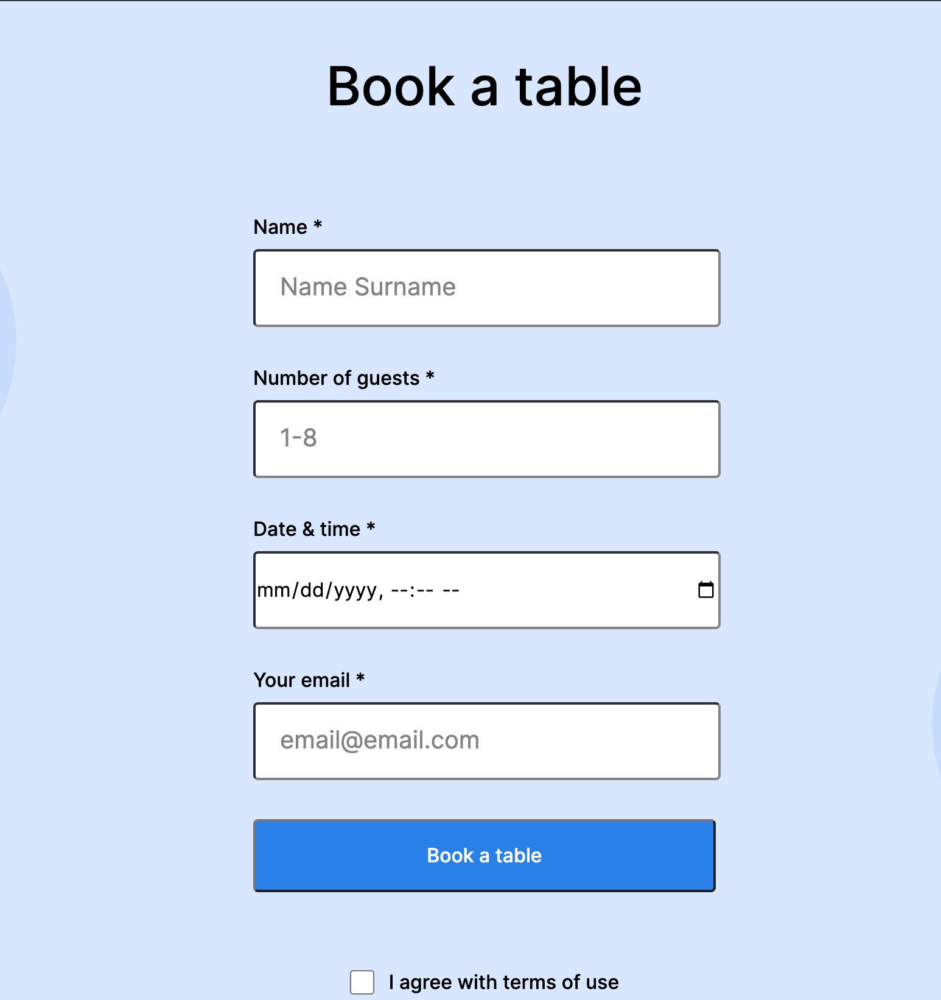

# Practicum Coffee Shop

This is the second project of the Software Engineer program at Practicum by Yandex. It was created using HTML and CSS, based on the design brief.

This website lays down a great foundation for use in different industries and scenarios. Many of the blocks are reusable elsewhere without changing most of their functions. Like the form block, which you can take and implement into another project to obtain required user info.

## Project features

- Semantic HTML5
- Flexbox
- Positioning
- Flat BEM
- A custom form
- CSS animation and transform

## Plans on improving the project

A few features that can be added to the project as the business grows:

- Online Coffee orders with a rewards program.
- Enhance the menu to be able to customize online orders.
- Merchandise page (coffee mugs, etc.).
